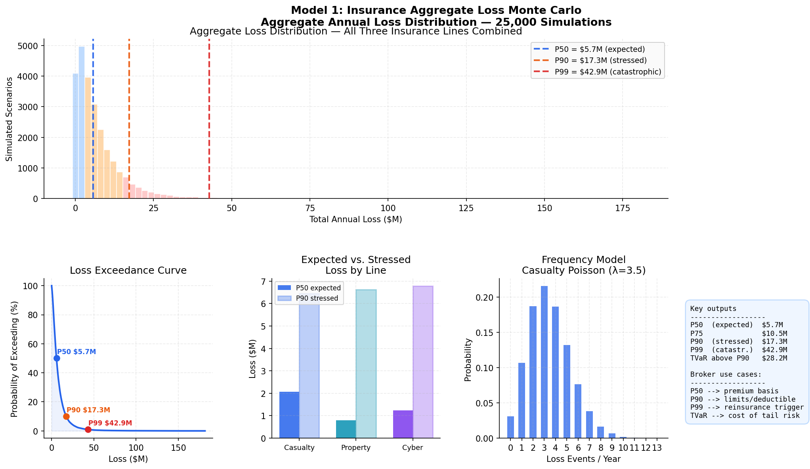
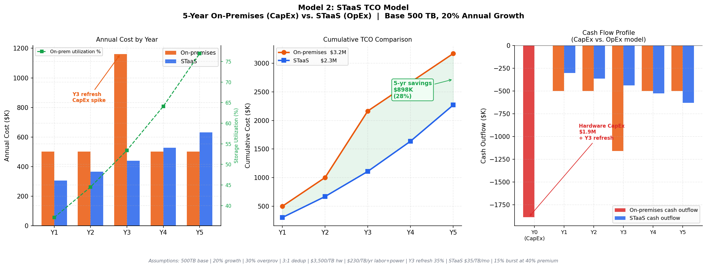
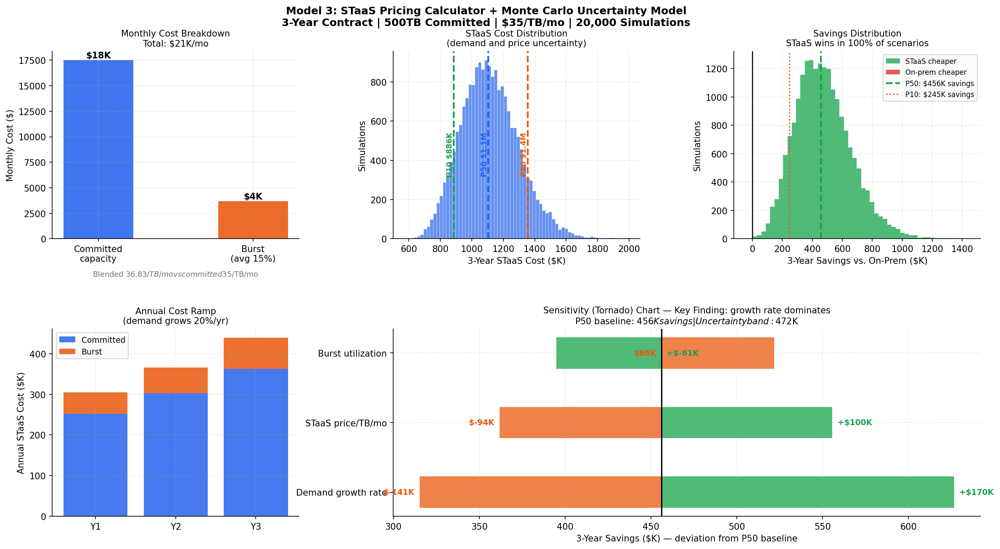
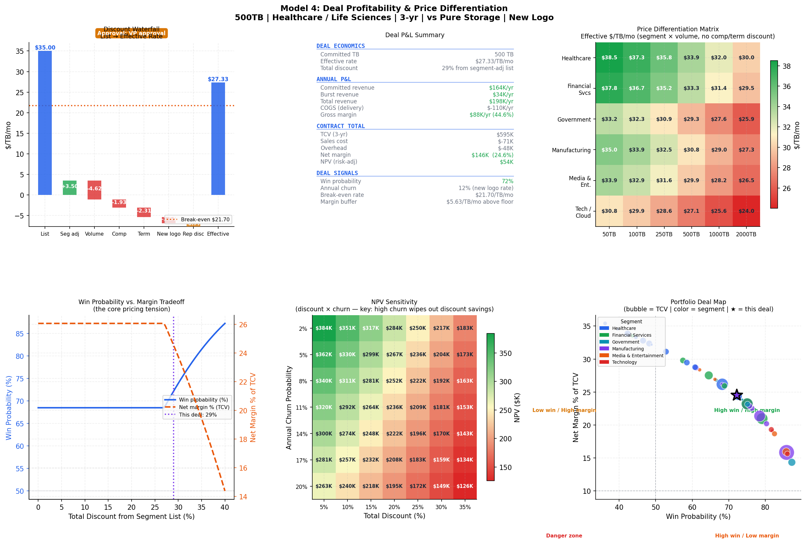

# Consumption Pricing Models for Enterprise Infrastructure

> Four interconnected financial models exploring how enterprise infrastructure vendors should price consumption-based offerings against CapEx alternatives — using **Storage-as-a-Service (STaaS)** as the case study.

---
**[🎮 Try the interactive deal profitability calculator →](https://markhenanliu-consumption-pricing-enterp-appstreamlit-app-qwfuqd.streamlit.app/)**

--- 

## A note on inputs and provenance

All inputs in this project — cost structures, segment multipliers, discount tiers, volume curves, insurance loss parameters — are **illustrative**, drawn from publicly available industry benchmarks. No proprietary or confidential data is used anywhere in this work. The insurance Monte Carlo in particular is a clean-room rebuild from public actuarial methodology; it is not the production model from any prior role and contains no information derived from work I've done in industry.

The point of the exploration is the structural reasoning, not the specific numbers. Change any assumption and rerun to see how the conclusions shift.

---

## Why I built this

During my internship in commercial risk advisory & risk analytics, I spent time translating Monte Carlo aggregate-loss models into client-facing analytics and recommendations. But my role then was to communicate the outputs, not build the engine. I wanted to revisit that domain and rebuild a model from scratch to both reinforce my understanding of the math and to see how broadly the same probabilistic toolkit transfers to other domains. 

Around the same time I came across the **Storage-as-a-Service (STaaS)** consumption-pricing model, and it introduced me to the storage industry's version of the broader CapEx-to-OpEx shift happening across enterprise infrastructure. This was intriguing as although the domain was outside my background — I did not know what "data reduction ratio" or "burst tier" meant — the underlying problem looked familiar. 

There exists a customer choosing between a large upfront commitment under uncertainty (CapEx hardware) and flexible pay-as-you-go (OpEx subscription), and it seemed like a domain where the same probabilistic approach could illuminate decisions and offer value for both sides of the market, the vendor and the customer.


---

## The models

### 1. Insurance Aggregate Loss Monte Carlo

A frequency-severity simulation across three commercial insurance lines — outputs the full annual loss distribution and the percentiles brokers actually use.

**Probability models:**
- **Poisson** — event frequency (count of loss events per year)
- **Lognormal** — severity (size of each loss; heavy right tail matches real claims data)
- **Gaussian copula** — cross-line correlation (systemic events affect multiple lines)

**Outputs and how brokers use them:**
- **P50** — expected loss → premium calculation basis
- **P90** — stressed loss → policy limits and deductible structure
- **P99** — catastrophic scenario → reinsurance attachment point
- **Loss exceedance curve** — full picture for client renewal conversations

This is the foundational model — the methodological piece I rebuilt from past commercial risk work before applying the same toolkit to the next three models.



---

### 2. STaaS TCO Model

A 5-year total-cost comparison: a CapEx-front-loaded on-premises deployment against a consumption-based STaaS subscription.

**Assumptions:**
- **Demand growth** — annual rate at which the customer's storage needs increase (e.g., 20%/yr)
- **Overprovisioning buffer** — extra capacity bought upfront to handle peak demand (e.g., 30%)
- **Data reduction ratio** — combined compression and deduplication factor that maps logical TB to physical TB (e.g., 3:1)
- **Hardware cost per TB** — enterprise all-flash array list price ($/TB physical)
- **Power & cooling** — operational overhead per TB physical per year
- **IT labor allocation** — dedicated storage admin cost per TB physical per year
- **Hardware refresh cycle** — Year-3 technology refresh as fraction of original CapEx
- **STaaS committed rate** — subscription price per TB per month
- **Burst pricing** — fraction of usage above committed, billed at premium (typically +40%)

> **Key takeaway:** The *cash flow profile* is more interesting here than the pure savings. CapEx storage forces customers to buy for Year-5 peak demand on Day 1, then potentially sit at low utilization for years. Consumption pricing flattens that curve.



---

### 3. Consumption Pricing + Uncertainty

The TCO model runs once on point estimates. Real decisions face uncertain inputs. This model wraps the deterministic calculator in a Monte Carlo layer (20,000 iterations) and runs sensitivity analysis to identify which input drives variance the most.

**Stochastic inputs:**
- **Demand growth** — normal distribution around mean forecast (mean ± std)
- **STaaS price** — normal distribution to model price volatility over contract term
- **Burst utilization** — fixed in baseline, varied in sensitivity analysis

**Outputs:**
- **P10 / P50 / P90** — cost percentiles and savings percentiles vs. on-prem benchmark
- **Win probability** — fraction of iterations in which STaaS beats on-prem
- **Tornado chart** — inputs ranked by their impact on median savings

> **Key finding:** demand growth uncertainty drives roughly 3× more variance in long-term savings than price negotiation does. Better forecasting beats harder negotiating.



---

### 4. STaaS Deal Profitability Engine

Where the first three models look at things from the customer's side, this one is the vendor's. It takes a specific deal and computes the full P&L.

**Inputs (per deal):**
- **Customer segment** — Healthcare, Financial Services, Government, Manufacturing, Media, Tech (each with a willingness-to-pay multiplier on list price)
- **Committed TB** — volume tier, drives volume discount on a non-linear curve
- **Contract length** — 1–5 years; longer terms unlock larger discounts
- **Competitor in deal** — Pure, HPE, Dell APEX, Hyperscaler, or none (each unlocks a different competitive discount)
- **New logo flag** — acquisition discount applies for first-install customers
- **Rep discretionary discount** — additional rep-driven adjustment

**Outputs:**
- **Effective rate** ($/TB/mo) — list price after the full discount stack is applied
- **Discount stack breakdown** — segment, volume, competitive, term, new logo, rep discretionary
- **Annual P&L** — committed + burst revenue, COGS, gross margin
- **Contract economics** — TCV, sales cost, overhead, net margin
- **NPV (risk-adjusted)** — discounted at WACC with churn-decayed survival probability
- **Win probability** — logistic curve of effective rate vs. list
- **Required approval tier** — rep / manager / deal desk / VP / executive

**Visualizations:** discount waterfall, P&L summary, segment × volume price differentiation matrix, win/margin tradeoff curve, NPV sensitivity grid, 40-deal portfolio map.

> **Key takeaway:** beyond ~25% total discount, win probability gains plateau while margin erodes linearly. The approval-tier system stands as a structural backstop against margin destruction.

⚠️ Win probability is modeled as a logistic function with illustrative parameters. It reflects the structural shape of price sensitivity, not empirically calibrated outcomes.



---

## Key findings

- **Demand growth uncertainty drives ~3× more variance in long-term savings than price negotiation.** For customers evaluating consumption pricing, forecasting capability is a higher-leverage skill than discount authority.

- **CapEx storage is fundamentally a bet on a 5-year peak-demand forecast.** Customers buy capacity they may never use; consumption models charge them for what they actually consume. The savings depend almost entirely on how wrong the original forecast turns out to be.

- **Discounting has diminishing returns.** Beyond ~25% total discount, win probability gains plateau while margin erodes linearly. The approval-tier system isn't bureaucratic — it's a structural backstop against margin destruction.

- **Pricing should be quantified with confidence intervals, not point estimates.** "$500K savings" on a slide is less defensible than "with 80% confidence, you save between $X and $Y over 3 years." This is just the actuarial habit translated into a sales context.

---

## Repo structure

```
consumption-pricing-enterprise-infra/
├── README.md
├── notebooks/
│   ├── 01_insurance_monte_carlo.ipynb    # Foundational frequency-severity engine
│   ├── 02_staas_tco.ipynb                # 5-year CapEx vs. OpEx comparison
│   ├── 03_consumption_pricing.ipynb      # Pricing with demand & price uncertainty
│   └── 04_deal_profitability.ipynb       # Vendor-side deal P&L engine
├── outputs/
│   ├── model1_insurance_monte_carlo.png
│   ├── model2_staas_tco.png
│   ├── model3_consumption_pricing.png
│   └── model4_deal_profitability.png
├── requirements.txt
└── .gitignore
```

## How to run

```bash
git clone https://github.com/<your-username>/consumption-pricing-enterprise-infra.git
cd consumption-pricing-enterprise-infra
pip install -r requirements.txt
jupyter notebook
```

Open any of the four notebooks and run all cells. Each is self-contained — no external data files required, all parameters are labeled and adjustable in the assumptions cell at the top of each model.

## Limitations & what's next

- **No bundling.** Real enterprise deals often include compute, networking, and software alongside storage. The pricing decisions are interdependent in ways this model doesn't capture.
- **Churn is exogenous.** I model churn as a fixed annual probability per customer type. In reality, churn responds to deal economics, support quality, and competitive pressure — a richer model would make it endogenous.
- **Behavioral curves aren't fit to data.** The win-probability function is logistic by assumption and segment multipliers are picked points; calibrating against actual deal outcomes (gradient boosting, as discussed in Model 3) is the natural next step.

Future explorations I'd like to take this in: cohort-based churn survival curves, multi-period dynamic pricing, and applying the same probabilistic deal engine to other consumption-priced categories (cloud compute, observability, security).

---

## Stack
**Modeling:** Python — NumPy, SciPy, Matplotlib  
**Interactive app:** Streamlit, Plotly  
**Development environment:** Cursor  
